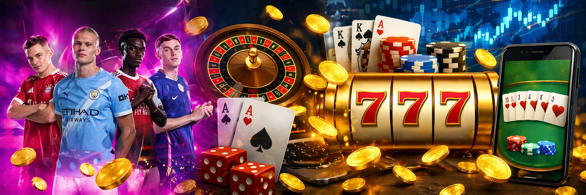
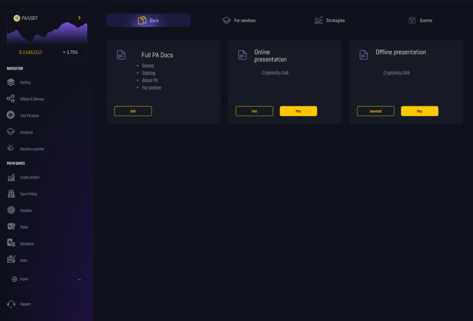
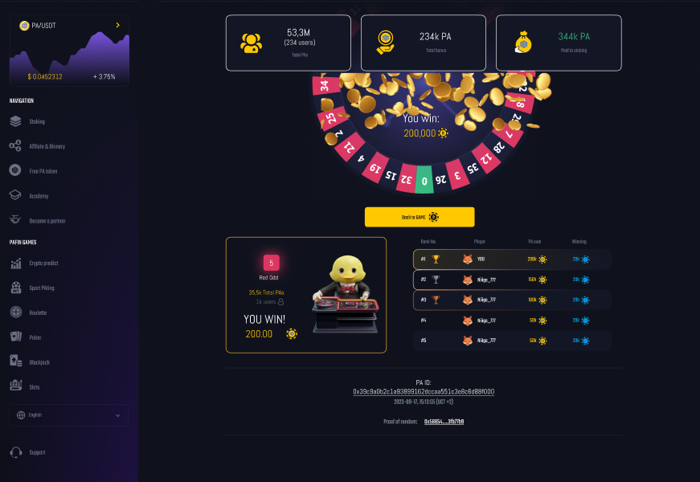

<p align="center">
  
</p>

<p align="center">
  
  
  
  
  
  
  
</p>

---

# 🚀 OverView

This is an immersive decentralized metaverse and blockchain gaming ecosystem built with modern Web3 technologies, a **Poker@ESports** that integrates staking, casino-style gaming, sports betting, and education into a single blockchain-powered ecosystem.

The platform combines multiplayer gameplay, NFT ownership, blockchain integration, AI systems, and real-time interactions to create a scalable next-generation gaming experience.

### Core Features
>✅ **Staking:** Lock PA tokens (and other supported assets) to earn rewards while funding the platform's gaming economy.        
>✅ **Gaming:** Casino-style games like roulette, slots, and prize wheels keep players engaged with quick, excitinh gameplay     
>✅ **Sports Betting:** Covers live and upcoming events, offering competitive odds and multiple bet types.                       
>✅ **Academy:** An interative learning hub teaching Crypto basics, platform mechanics, and risk management to onboard newcomers.

The goal is to create an **all-in-one hub** where players can **play, earn, and learn** without hopping between multiple platforms.

---


## Demo Version
The demo highlights:
>✅ **Staking Dashboard** – Simulated staking with reward tracking.               
>✅ **Mini Games Preview** – Early builds of roulette, slots, and spin-the-wheel. <br>
>✅ **Sports Betting UI** – Mock-up with odds feeds and betting slip preview.     
>✅ **Academy Hub** – Interactive tutorials and gamified quizzes.                 

**Note:** This demo uses **testnet contracts** and mock data for demonstration. It is **not connected to mainnet or real funds**.

---

### Staking Dashboard
  
*Lock Game tokens and monitor rewards in real-time.*

### Game Lobby
  
*Casino-style game previews including roulette, slots, and prize wheel.*

---

## Tech Stack
>✅ **Frontend** – React / Next.js / TailwindCSS              
>✅ **Blockchain** – Solidity / Hardhat / Ethers.js           
>✅ **Backend** – Node.js / TypeScript / PostgreSQL / Redis   
>✅ **Games** – Phaser.js / Unity / WebGL                     
>✅ **Sports Data** – Integrated via 3rd-party APIs           
>✅ **Enterprise Layer** – SettleMint BCDB middleware       


# 📁 Project Structure

```text
├───.vscode
├───client
│   ├───public
│   └───src
│       ├───apis
│       ├───assets
│       │   ├───fonts
│       │   ├───game
│       │   │   ├───cards
│       │   │   └───cards-svg
│       │   ├───icons
│       │   └───img
│       ├───components
│       │   ├───buttons
│       │   ├───cookies
│       │   ├───decoration
│       │   ├───forms
│       │   ├───game
│       │   │   ├───Betslider
│       │   │   ├───BrandingImage
│       │   │   └───Seat
│       │   ├───icons
│       │   ├───layout
│       │   ├───loading
│       │   ├───logo
│       │   ├───modals
│       │   ├───navigation
│       │   ├───routing
│       │   ├───typography
│       │   └───user
│       ├───context
│       │   ├───game
│       │   ├───global
│       │   ├───localization
│       │   ├───modal
│       │   └───websocket
│       ├───game
│       ├───helpers
│       ├───hooks
│       ├───pages
│       │   └───ConnectWallet
│       ├───styles
│       └───utils
├───config
├───controllers
├───game
├───middleware
├───models
├───routes
│   └───api
├───socket
└───utils
```

---

# 🛠️ Prerequisites

Before starting, install the following:

- Node.js v20+
- npm or yarn
- Git
- MongoDB
- Polygon
- MataMask Wallet

---

# 🚀 Quick Start

## 1️⃣ Clone Repository

```bash
git clone repository
cd directory
```

---

## 2️⃣ Install Dependencies

```bash
npm install
```

or

```bash
yarn install
```


# ▶️ Run Development Servers

## Start Backend

```bash
cd server
npm run dev
```

---

## Start Frontend

```bash
cd client
npm run dev
```

---

# 🌐 Access Application

Frontend:

```bash
http://localhost:3000
```

Backend API:

```bash
http://localhost:7777
```

---

# 🔗 Wallet Integration

supports:

- MetaMask Wallet
- Coinbase Wallet

Players can securely:

- Sign transactions
- Own NFTs
- Trade digital assets
- Join multiplayer gameplay

---

# 🏗️ System Architecture

```text
+----------------------+
|      Frontend        |
| React / Next.js      |
| Three.js / Babylon   |
+----------+-----------+
           |
           v
+----------------------+
|      Backend API     |
| Node.js / Express    |
| Socket.IO            |
+----------+-----------+
           |
           v
+----------------------+
|      Blockchain      |
| Solana / Web3.js     |
| Smart Contracts      |
+----------+-----------+
           |
           v
+----------------------+
|      Database        |
| MongoDB / Redis      |
+----------------------+
```

---

# 🔐 Security

This follows modern Web3 security practices:

- Wallet-based authentication
- Encrypted sessions
- Protected APIs
- Smart contract verification
- Rate limiting
- Infrastructure security

---

# 🗺️ Roadmap

- [x] Core Architecture
- [x] Wallet Integration
- [x] Multiplayer Support
- [x] NFT Integration
- [ ] NFT Marketplace
- [ ] AI NPC Systems
- [ ] DAO Governance
- [ ] Mobile Application
- [ ] VR Integration
- [ ] Token Staking

---

# 🤝 Contributing

Contributions are welcome.

## Steps

1. Fork repository
2. Create feature branch

```bash
git checkout -b feature/amazing-feature
```

3. Commit changes

```bash
git commit -m "Add amazing feature"
```

4. Push branch

```bash
git push origin feature/amazing-feature
```

5. Open Pull Request

---

# 📄 License

MIT License

---

# 👨‍💻 Developer

Built with passion by the Our Team.

---

# 🙏 Acknowledgements

- Polygon
- React
- Next.js
- Three.js
- Babylon.js
- MongoDB
- Tailwind CSS
- Open Source Community

---

# ⚖️ Disclaimer

This project is provided for educational and development purposes only.

Users are responsible for compliance with local blockchain and digital asset regulations.

---

<p align="center">
  🌌 Built for the Future of Web3 Gaming 🚀
</p>
